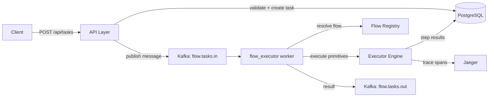
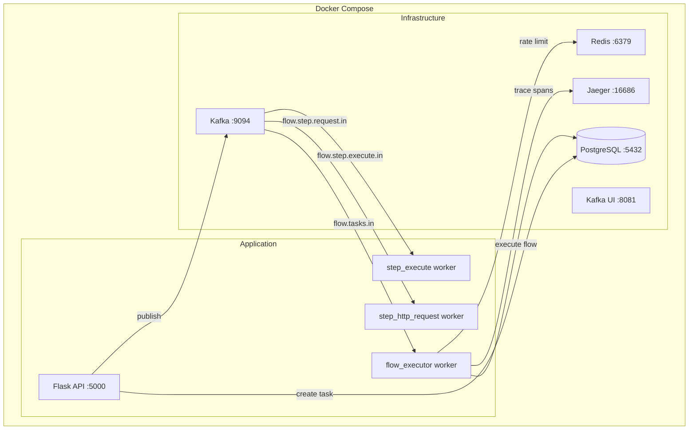
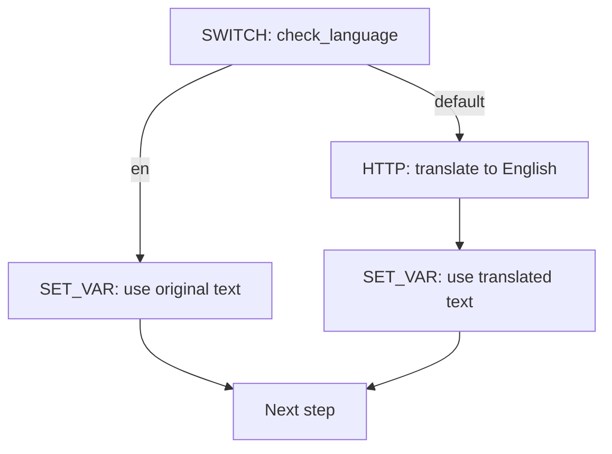
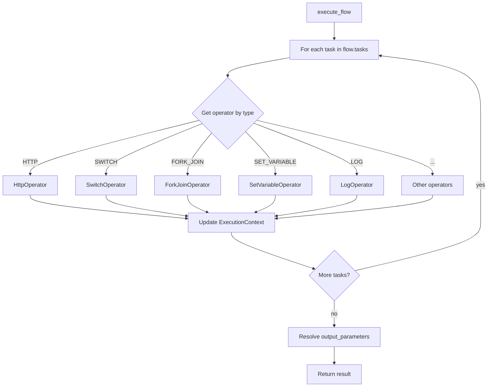
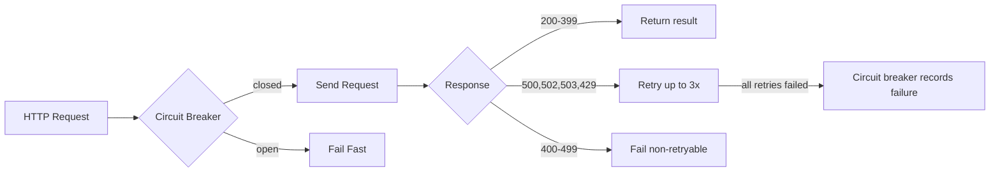

# AI Flow Orchestrator

An on-demand AI pipeline orchestrator built on the **QF Framework**. Receives an input (file upload, raw text, or YouTube link) along with a desired output type (NER, Sentiment, Summary, etc.) and **automatically resolves and executes the full chain of primitives** needed to produce the result.

---

## Core Concepts

| Concept | What it is | Example |
|---|---|---|
| **Primitive** | A DSL building block (HTTP, SWITCH, TRANSFORM, etc.) | The `HTTP` primitive can call any API |
| **Task** | A user request: input + desired output | `input=test.mp4, desired_output=ner` |
| **Flow** | An ordered sequence of primitives that achieves a task | `HTTP(stt) -> HTTP(lang-detect) -> SWITCH -> HTTP(ner)` |

**Key insight:** STT, NER, Translate, Sentiment, etc. are NOT separate primitives. They are all **instances of the HTTP request primitive** configured with different URLs and bodies. The 10 primitives are: `HTTP`, `SWITCH`, `FORK_JOIN`, `DO_WHILE`, `SET_VARIABLE`, `TRANSFORM`, `SUB_WORKFLOW`, `TERMINATE`, `WAIT`, `LOG`.

---

## How It Works



### Request Lifecycle

1. **Client** sends `POST /api/tasks` with `input_type`, `input_data`, and `desired_output`
2. **API layer** validates input, resolves the flow strategy, creates a task record in PostgreSQL (status: `PENDING`), and publishes a message to `flow.tasks.in`
3. **flow_executor** Kafka worker picks up the message, loads the flow definition, and starts executing primitives sequentially
4. **Executor engine** dispatches each primitive to its operator (HTTP, SWITCH, SET_VARIABLE, etc.), updating the execution context after each step
5. **Task status** updates in PostgreSQL: `PENDING` -> `RUNNING` -> `COMPLETED` (or `FAILED`/`TERMINATED`)
6. **Result** is published to `flow.tasks.out` and stored as `final_output` in PostgreSQL
7. **Client** polls `GET /api/tasks/{task_id}` to retrieve status and result

---

## Task Execution Example: `file_upload -> NER`

```
Task:   input=test.mp4, desired_output=ner
Flow:   flow_video_to_ner (8 primitives)
Chain:  LOG -> HTTP(stt) -> HTTP(language_detect) -> SWITCH(check_language)
              -> HTTP(translate_to_en) -> SET_VAR -> HTTP(ner) -> LOG

  LOG(log_start):            SUCCESS
  HTTP(stt):                 SUCCESS (718ms)   -- transcribe audio to text
  HTTP(language_detect):     SUCCESS (563ms)   -- detect source language -> "de"
  SWITCH(check_language):    SUCCESS           -- "de" != "en", take default branch
    HTTP(translate_to_en):   SUCCESS (1815ms)  -- translate German -> English
    SET_VAR(processed_text): SUCCESS           -- store translated text
  HTTP(ner):                 SUCCESS (1270ms)  -- extract named entities
  LOG(log_end):              SUCCESS

Result: {
  entities: [
    {text: "Chancellor", type: "TITLE"},
    {text: "Berlin", type: "LOCATION"},
    {text: "Angela Merkel", type: "PERSON"}
  ],
  language_detected: "de"
}
```

---

## Architecture

### System Components



### Kafka Workers

| Worker | Topic In | Topic Out | Purpose |
|---|---|---|---|
| `flow_executor` | `flow.tasks.in` | `flow.tasks.out` | Main orchestrator — resolves and executes full flows |
| `step_http_request` | `flow.step.request.in` | `flow.step.request.out` | Stateless HTTP request primitive |
| `step_execute` | `flow.step.execute.in` | `flow.step.execute.out` | Stateless generic primitive executor |

The subflow workers are **stateless**: they receive a Kafka message containing the full task definition + prior step outputs, execute the primitive, and publish the result. The main `flow_executor` can chain them via Kafka for fully async execution, or execute primitives inline (current default).

### Infrastructure Services

| Service | Image | Port | Purpose |
|---|---|---|---|
| **Kafka** | `bitnami/kafka:3.7` | 9094 | Async task dispatch and step chaining (KRaft mode, no ZooKeeper) |
| **PostgreSQL** | `postgres:15-alpine` | 5432 | Task persistence (`tasks` + `task_step_logs` tables) |
| **Redis** | `redis:7-alpine` | 6379 | QF rate-limiting state + aggregator |
| **Jaeger** | `jaegertracing/all-in-one:1.56` | 16686 | Distributed tracing via OTLP (gRPC :4317, HTTP :4318) |
| **Kafka UI** | `provectuslabs/kafka-ui:v0.7.2` | 8081 | Visual Kafka topic browser |

---

## Quickstart

### Start infrastructure + app

```bash
# Start everything (infrastructure + app)
docker compose up -d

# Or infrastructure only (for local development)
docker compose up -d kafka redis postgres jaeger
pip install dist/qf-1.0.2-py3-none-any.whl
pip install -r requirements.txt
python main.py
```

### Verify services

```bash
docker compose ps
# Expected: all services show "healthy"

curl http://localhost:5000/api/health
# {"status":"healthy","dev_mode":true,"primitives":10,"flows":9,"supported_outputs":[...]}
```

### Create your first task

```bash
curl -X POST http://localhost:5000/api/tasks \
  -H "Content-Type: application/json" \
  -d '{
    "input_type": "text",
    "input_data": "John Smith lives in New York and works at Acme Corp.",
    "desired_output": "ner"
  }'
# Returns: {"id": "uuid", "status": "PENDING", "resolved_flow": "flow_text_to_ner", ...}

# Poll for result
curl http://localhost:5000/api/tasks/{task_id}
# Returns: {"status": "COMPLETED", "final_output": {"entities": [...]}, ...}
```

---

## API Reference

### `POST /api/tasks` — Create a task

**JSON body:**
```json
{
  "input_type": "text | file_upload | youtube_link",
  "input_data": "raw text or YouTube URL (string or object)",
  "desired_output": "ner | sentiment | summary | stt | language_detect | translate | taxonomy"
}
```

**File upload (multipart/form-data):**
```bash
curl -X POST http://localhost:5000/api/tasks \
  -F "input_type=file_upload" \
  -F "desired_output=stt" \
  -F "file=@/path/to/audio.mp4"
```

**Response** `201 Created`:
```json
{
  "id": "78df0b14-41ce-4339-845b-11283bf55dd7",
  "input_type": "text",
  "desired_output": "ner",
  "resolved_flow": "flow_text_to_ner",
  "status": "PENDING",
  "created_at": "2026-04-01T20:50:04.927Z"
}
```

**Validation errors** `400 Bad Request`:
- Missing `input_type` or `desired_output`
- Invalid `input_type` (must be `text`, `file_upload`, or `youtube_link`)
- Invalid `desired_output` (must be a registered output type)
- Unsupported combination (e.g. `text` + `stt` has no flow)

### `GET /api/tasks` — List tasks

Query parameters: `status`, `input_type`, `desired_output`, `limit` (default 50), `offset` (default 0)

```bash
curl "http://localhost:5000/api/tasks?status=COMPLETED&desired_output=ner&limit=10"
```

### `GET /api/tasks/{task_id}` — Get task detail

Returns task with full `step_logs` from PostgreSQL.

### `DELETE /api/tasks/{task_id}` — Delete task

Removes task and all associated step logs.

### `GET /api/health` — Health check

Returns app status, primitive count, flow count, and supported outputs.

### `GET /api/flows` — List flow strategies

Returns all registered `(input_type, desired_output) -> flow_id` mappings.

---

## Supported Tasks

Each row is a **task** (input + desired output). The **flow** is the primitive chain executed to achieve it.

| Task | Flow ID | Primitive Chain |
|---|---|---|
| `file_upload -> stt` | `flow_video_to_stt` | LOG -> HTTP(stt) -> LOG |
| `file_upload -> ner` | `flow_video_to_ner` | LOG -> HTTP(stt) -> HTTP(lang-detect) -> SWITCH -> [HTTP(translate) -> SET_VAR] -> HTTP(ner) -> LOG |
| `file_upload -> sentiment` | `flow_video_to_sentiment` | LOG -> HTTP(stt) -> HTTP(lang-detect) -> SWITCH -> [HTTP(translate) -> SET_VAR] -> HTTP(sentiment) -> LOG |
| `file_upload -> summary` | `flow_video_to_summary` | LOG -> HTTP(stt) -> HTTP(lang-detect) -> SWITCH -> [HTTP(translate) -> SET_VAR] -> HTTP(summary) -> LOG |
| `text -> ner` | `flow_text_to_ner` | LOG -> HTTP(lang-detect) -> SWITCH -> [HTTP(translate) -> SET_VAR] -> HTTP(ner) -> LOG |
| `text -> sentiment` | `flow_text_to_sentiment` | LOG -> HTTP(lang-detect) -> SWITCH -> [HTTP(translate) -> SET_VAR] -> HTTP(sentiment) -> LOG |
| `text -> summary` | `flow_text_to_summary` | LOG -> HTTP(lang-detect) -> SWITCH -> [HTTP(translate) -> SET_VAR] -> HTTP(summary) -> LOG |
| `youtube_link -> stt` | `flow_youtube_to_stt` | LOG -> HTTP(download) -> HTTP(stt) -> LOG |
| `youtube_link -> ner` | `flow_youtube_to_ner` | LOG -> HTTP(download) -> HTTP(stt) -> HTTP(lang-detect) -> SWITCH -> [HTTP(translate) -> SET_VAR] -> HTTP(ner) -> LOG |

---

## DSL Primitives

10 primitives defined in `src/templating/templates/`, each with a JSON schema and examples.

### HTTP — External API calls

The universal primitive. STT, NER, Translate, Sentiment — all are instances of HTTP configured with different URLs and bodies.

```json
{
  "task_ref": "call_stt_api",
  "type": "HTTP",
  "input_parameters": {
    "http_request": {
      "method": "POST",
      "url": "{{env.AI_STT_URL}}/transcribe",
      "headers": {"Content-Type": "application/json"},
      "body": {"file_path": "{{workflow.input.file_path}}"},
      "timeout_seconds": 600
    }
  },
  "output_mapping": {
    "text": "$.response.body.text"
  },
  "mock_response": {"text": "Mocked transcription.", "language": "en"}
}
```

**Features:**
- Retry with tenacity (3 attempts, configurable retryable status codes: 500, 502, 503, 429)
- Circuit breaker via pybreaker (fail_max=10, reset_timeout=30s)
- Configurable timeout per step
- `output_mapping` extracts fields from response using JSONPath
- `mock_response` used in DEV_MODE (returns mock with simulated 0.5-2s delay)

### SWITCH — Conditional branching

Routes execution based on expression evaluation. Used for language-based routing (translate if not English).

```json
{
  "task_ref": "check_language",
  "type": "SWITCH",
  "expression": "{{steps.language_detect.output.language}}",
  "decision_cases": {
    "en": [
      {"task_ref": "set_en_text", "type": "SET_VARIABLE", "input_parameters": {"processed_text": "{{steps.language_detect.output.text}}"}}
    ]
  },
  "default_case": [
    {"task_ref": "translate_to_en", "type": "HTTP", "...": "..."},
    {"task_ref": "set_translated_text", "type": "SET_VARIABLE", "...": "..."}
  ]
}
```



### FORK_JOIN — Parallel execution

Runs multiple branches in parallel using ThreadPoolExecutor, then joins results. Configurable `max_workers` (default 4) and `join_on` requirements.

```json
{
  "task_ref": "parallel_analysis",
  "type": "FORK_JOIN",
  "fork_tasks": [
    [{"task_ref": "ner", "type": "HTTP", "...": "..."}],
    [{"task_ref": "sentiment", "type": "HTTP", "...": "..."}]
  ],
  "join_on": ["ner", "sentiment"]
}
```

### DO_WHILE — Loop execution

Executes a list of tasks in a loop while a condition is true. Safety limit via `max_iterations` (default 100, configurable).

```json
{
  "task_ref": "paginated_fetch",
  "type": "DO_WHILE",
  "loop_condition": "{{steps.fetch_page.output.has_next}} == true",
  "loop_over": [
    {"task_ref": "fetch_page", "type": "HTTP", "...": "..."}
  ],
  "max_iterations": 50
}
```

### SET_VARIABLE — Store workflow variables

Sets variables in the execution context, accessible via `{{workflow.variables.<name>}}`. Used to bridge data between SWITCH branches.

### TRANSFORM — Inline data reshaping

Transforms data without external calls. Evaluates `expression` using interpolation.

### SUB_WORKFLOW — Nested flow execution

Invokes another flow definition as a child. Creates an isolated child context with its own input. Depth-limited to prevent infinite recursion (default max depth: 10).

### TERMINATE — Early exit

Halts flow execution with a status and reason. Raises `TerminateFlowException` which is caught by the executor.

### WAIT — Pause execution

Pauses for a configurable duration or until an external signal. Used for human-in-the-loop approval or rate limiting.

### LOG — Structured audit entry

Writes structured log entries at configurable levels (INFO, DEBUG, WARNING, ERROR). Used for observability at flow start/end.

---

## Variable Interpolation Engine

The interpolator (`src/core/interpolator.py`) resolves `{{...}}` expressions recursively in strings, dicts, and lists.

| Pattern | Example | Description |
|---|---|---|
| `{{workflow.input.<field>}}` | `{{workflow.input.file_path}}` | Workflow-level input data |
| `{{steps.<ref>.output.<field>}}` | `{{steps.stt.output.text}}` | Output from a previous step |
| `{{env.<VAR>}}` | `{{env.AI_STT_URL}}` | Environment variable |
| `{{workflow.variables.<var>}}` | `{{workflow.variables.processed_text}}` | Variables set by SET_VARIABLE |
| `{{now()}}` | `2026-04-01T20:50:04.927Z` | Current ISO timestamp |
| `{{len(expr)}}` | `{{len(steps.ner.output.entities)}}` | Length of string/array |
| Comparisons | `{{steps.x.output.y != 'en'}}` | Returns boolean (`==`, `!=`, `>`, `<`, `>=`, `<=`) |

**Type preservation:** If the entire string is a single expression `{{...}}`, the resolved value's original type is preserved (dict, list, int, etc.). Mixed expressions are always stringified.

**Deep access:** Supports dot-notation traversal into nested dicts and list indices: `{{steps.result.output.items.0.name}}`.

---

## Flow Resolution

The resolver (`src/core/resolver.py`) maps `(input_type, desired_output)` pairs to flow IDs:

```python
FLOW_STRATEGIES = {
    ("file_upload", "ner"):       "flow_video_to_ner",
    ("text",        "sentiment"): "flow_text_to_sentiment",
    ("youtube_link", "stt"):      "flow_youtube_to_stt",
    # ... 18+ strategies
}
```

Flow definitions are JSON files in `src/templating/flows/`. Each flow defines:
- `flow_id`, `name`, `version`, `description`
- `input_schema` (expected input fields)
- `output_parameters` (what to extract from step outputs as the final result)
- `tasks` (ordered list of primitives to execute)

---

## Executor Engine

The executor (`src/core/executor.py`) processes flows step by step:



**Execution context** (`src/core/context.py`) holds:
- `workflow_input` — original task input data
- `env` — environment variables (AI service URLs, etc.)
- `steps` — outputs from completed steps (`{task_ref: {output, status, duration_ms}}`)
- `variables` — workflow variables set by SET_VARIABLE
- `depth` — sub-workflow nesting level

Each step's output is stored in the context and available to subsequent steps via `{{steps.<ref>.output.<field>}}`.

---

## HTTP Client & Resilience

The HTTP client (`src/core/http_client.py`) implements:

- **Retry**: 3 attempts with 1s fixed wait (tenacity), only for retryable status codes (500, 502, 503, 429)
- **Circuit breaker**: Opens after 10 consecutive failures, resets after 30s (pybreaker)
- **Timeout**: Configurable per-request (default 120s)
- **Error classification**: Retryable errors (5xx, 429) vs. non-retryable (4xx)



---

## Tracing

OpenTelemetry tracing is integrated at key points, exporting spans to Jaeger via OTLP gRPC.

**Traced operations:**
| Span | Location | Attributes |
|---|---|---|
| `flow_executor` | Kafka worker | task.id, flow.id, task.status |
| `execute_flow` | Executor engine | flow.id, flow.tasks_count |
| `execute_step.{ref}` | Per-step execution | step.ref, step.type, step.status, step.duration_ms |
| `http_request.{ref}` | HTTP operator (real) | http.method, http.url, http.status_code |
| `http_mock.{ref}` | HTTP operator (DEV_MODE) | http.mock=true |
| `switch.{ref}` | SWITCH operator | switch.expression_value, switch.branch_taken |
| `api.task_create` | API endpoint | task.id, task.input_type, task.desired_output |
| `api.task_get` | API endpoint | task.id |

**Enable:** Set `ENABLE_TRACING=true` in `.env`. View traces at `http://localhost:16686` (Jaeger UI).

---

## Database Schema

### `tasks` table

| Column | Type | Description |
|---|---|---|
| `id` | UUID (PK) | Task identifier |
| `input_type` | VARCHAR(50) | `text`, `file_upload`, `youtube_link` |
| `input_data` | JSONB | Original input (text, file_path, youtube_url) |
| `desired_output` | VARCHAR(50) | `ner`, `sentiment`, `summary`, `stt`, etc. |
| `resolved_flow` | VARCHAR(100) | Flow ID (e.g. `flow_text_to_ner`) |
| `resolved_flow_definition` | JSONB | Full flow JSON (snapshot at creation time) |
| `status` | VARCHAR(20) | `PENDING`, `RUNNING`, `COMPLETED`, `FAILED`, `TERMINATED` |
| `current_step` | VARCHAR(100) | Currently executing step ref |
| `step_results` | JSONB | All step outputs `{ref: {output, status, duration_ms}}` |
| `workflow_variables` | JSONB | Variables set during execution |
| `final_output` | JSONB | Resolved output of the flow |
| `error` | JSONB | Error details if failed |
| `retry_count` | INTEGER | Kafka retry count |
| `created_at` | TIMESTAMP | Task creation time (UTC) |
| `updated_at` | TIMESTAMP | Last update time (UTC) |

### `task_step_logs` table

| Column | Type | Description |
|---|---|---|
| `id` | INTEGER (PK) | Auto-increment |
| `task_id` | UUID (FK) | Parent task |
| `task_ref` | VARCHAR(100) | Step reference name |
| `task_type` | VARCHAR(50) | Primitive type (HTTP, SWITCH, etc.) |
| `status` | VARCHAR(20) | Step status |
| `response_payload` | JSONB | Step output |
| `error_message` | TEXT | Error if failed |
| `duration_ms` | INTEGER | Execution duration |
| `created_at` | TIMESTAMP | Step execution time |

---

## DEV_MODE

When `DEV_MODE=true` (default in `.env`):
- HTTP primitives return `mock_response` from the flow definition instead of calling real services
- Mock responses include a simulated 0.5-2s random delay
- Logs clearly indicate `[MOCK]` responses
- All other primitives (SWITCH, TRANSFORM, SET_VARIABLE, LOG, FORK_JOIN) execute normally
- Kafka, Redis, PostgreSQL are always real Docker services
- Tracing works the same (mock spans appear in Jaeger)

---

## QF Framework Integration

| QF Feature | Usage in This App |
|---|---|
| `FrameworkApp` + `FrameworkSettings` | App entry point — runs ETL (Kafka) + HTTP (Flask) in one process |
| `@kafka_handler` (single mode) | Flow executor + 2 stateless subflow workers |
| `@retry_to_dlq` | Failed tasks retried 3x then routed to DLQ topic |
| `@rate_limit` | Throttle executor (100 rps) and step workers (100-200 rps) via Redis |
| Dynamic endpoints (`endpoint.json`) | REST API endpoints mapped to Python handlers |
| `framework.tracing` | OpenTelemetry tracer initialization + `get_tracer()` |
| `framework.commons.logger` | Structured logging throughout |

---

## Configuration

All configuration is loaded from `.env` via `python-dotenv`. See `.env.example` for all available variables.

| Variable | Default | Description |
|---|---|---|
| `DEV_MODE` | `true` | Mock HTTP responses instead of calling real AI services |
| `DATABASE_URL` | `postgresql://qf:qf@localhost:5432/ai_flow` | PostgreSQL connection string |
| `KAFKA_BOOTSTRAP_SERVERS` | `localhost:9094` | Kafka broker address |
| `REDIS_HOST` | `localhost` | Redis host |
| `ENABLE_TRACING` | `false` | Enable OpenTelemetry span export to Jaeger |
| `QSINT_OTLP_ENDPOINT` | `http://localhost:4317` | OTLP gRPC endpoint for trace export |
| `AI_SERVICE_URL` | `http://localhost:8000` | Base URL for AI services |
| `API_PORT` | `5000` | HTTP API listen port |
| `MAX_LOOP_ITERATIONS` | `100` | Safety limit for DO_WHILE loops |
| `FORK_JOIN_MAX_WORKERS` | `4` | Max threads for parallel branch execution |
| `MAX_SUB_WORKFLOW_DEPTH` | `10` | Max nesting depth for SUB_WORKFLOW |

---

## Adding New Capabilities

### New AI service (e.g. Topic Classification)

No new primitive needed — just another `HTTP` request in a flow definition:

```json
{
  "task_ref": "topic_classify",
  "type": "HTTP",
  "input_parameters": {
    "http_request": {
      "method": "POST",
      "url": "{{env.AI_TOPIC_URL}}/classify",
      "body": {"text": "{{workflow.variables.processed_text}}"}
    }
  },
  "mock_response": {"topics": [{"label": "technology", "score": 0.9}]}
}
```

### New flow

1. Create a flow definition JSON in `src/templating/flows/`
2. Register the strategy in `src/core/resolver.py`:
```python
FLOW_STRATEGIES[("text", "topic_classify")] = "flow_text_to_topic_classify"
```

### New primitive type

1. Implement operator in `src/core/operators/my_operator.py` (extend `BaseOperator`)
2. Register in `src/core/executor.py` OPERATORS dict
3. Add schema in `src/templating/templates/my_primitive.json`

---

## Running Tests

```bash
make test                # All tests (87 tests)
make test-unit           # Unit tests only (54 tests)
make test-integration    # Integration tests (33 tests — requires PostgreSQL)
make validate-templates  # Validate all primitive and flow JSON files
make lint                # Run flake8 linter
```

### Test Suites

| Suite | Tests | What it covers |
|---|---|---|
| `tests/unit/` | 54 | Operators, interpolator, expression evaluator, resolver, loader, HTTP client |
| `tests/integration/test_full_pipeline.py` | 9 | End-to-end flow execution in DEV_MODE (no DB required) |
| `tests/integration/test_full_environment.py` | 12 | Full lifecycle: PostgreSQL create -> execute flow -> verify DB state |

### Integration test output

Each integration test prints a task execution report:

```
======================================================================
  TASK:     file_upload -> ner
  FLOW:     flow_video_to_ner
  TASK ID:  f182333a-5e00-437a-9be2-3a7415a4b21f
  DB STATE: COMPLETED
  STEPS:    8 primitives (7278ms total)
    log_start: SUCCESS (0ms)
    stt: SUCCESS (1957ms)
    language_detect: SUCCESS (1031ms)
    translate_to_en: SUCCESS (1611ms)
    set_translated_text: SUCCESS (0ms)
    check_language: SUCCESS (1615ms)
    ner: SUCCESS (1064ms)
    log_end: SUCCESS (0ms)
  VARS:     {processed_text: "The Chancellor gave an important speech..."}
  RESULT:   {entities: [Chancellor, Berlin, Angela Merkel], language_detected: "de"}
  DB LOGS:  8 step logs in PostgreSQL
======================================================================
```

---

## Known Limitations

- **No authentication** — `DISABLE_SECURITY=True` is set by default; API endpoints are unprotected
- **No database migrations** — Schema created via `Base.metadata.create_all()`; no alembic migrations yet
- **No API rate limiting** — Rate limiting exists on Kafka workers but not on HTTP API endpoints
- **No graceful shutdown** — Abrupt termination may lose in-flight Kafka messages
- **Single Kafka broker** — Docker setup uses 1 broker with replication factor 1 (not production-safe)
- **Fixed retry backoff** — HTTP client retries with fixed 1s wait instead of exponential backoff
- **No task timeout** — Long-running flows have no upper time limit
- **No data retention** — Completed tasks accumulate in PostgreSQL indefinitely
- **Global circuit breaker** — All HTTP services share one circuit breaker instance
- **No webhook callbacks** — Clients must poll `GET /api/tasks/{id}` for results

See `prompt_prod_ready.md` for the full production readiness plan with prioritized tasks.

---

## Project Structure

```
ai-flow-orchestrator/
+-- main.py                          # Entry point (FrameworkApp)
+-- .env                             # Environment variables (loaded by dotenv)
+-- .env.example                     # Template for .env
+-- docker-compose.yml               # Kafka, Redis, PostgreSQL, Jaeger, app
+-- Dockerfile                       # Multi-stage build (builder + slim runtime)
+-- Makefile                         # Dev shortcuts (test, lint, docker, migrate)
+-- requirements.txt                 # Python dependencies
+-- maps/endpoint.json               # QF dynamic endpoint definitions
+-- prompt_prod_ready.md             # Production readiness task list
+-- src/
|   +-- config.py                    # All env vars loaded from .env
|   +-- api/
|   |   +-- endpoints.py            # HTTP handlers (tasks CRUD, health, flows)
|   |   +-- validators.py           # Input validation (type, output, combination)
|   |   +-- schemas.py              # Flask-RESTX models
|   +-- core/
|   |   +-- resolver.py             # Flow strategy resolver (input_type + desired_output -> flow_id)
|   |   +-- executor.py             # Main loop engine (dispatches to operators, traced)
|   |   +-- context.py              # Execution context (steps, variables, input, env)
|   |   +-- interpolator.py         # {{variable}} rendering engine (recursive, type-preserving)
|   |   +-- expression_evaluator.py # Condition evaluation for SWITCH and DO_WHILE
|   |   +-- http_client.py          # HTTP caller (tenacity retry + pybreaker circuit breaker)
|   |   +-- subflow_workers.py      # Stateless Kafka workers (generic primitives)
|   |   +-- operators/              # One class per primitive type (10 operators)
|   +-- templating/
|   |   +-- loader.py               # JSON file loader for templates and flows
|   |   +-- registry.py             # In-memory registry (primitives + flows)
|   |   +-- validator.py            # Schema validation for task definitions and flows
|   |   +-- templates/              # Primitive definitions (10 JSON schemas)
|   |   +-- flows/                  # Flow definitions (9 pipeline JSONs)
|   +-- models/
|   |   +-- task.py                 # SQLAlchemy model (Task) + DB engine/session
|   |   +-- task_step_log.py        # SQLAlchemy model (TaskStepLog)
|   +-- services/
|   |   +-- task_service.py         # Business logic (create, get, list, update, delete)
|   +-- workers/
|       +-- flow_executor.py        # Main Kafka worker (@kafka_handler, traced)
+-- tests/
    +-- conftest.py                  # Shared fixtures (context, env defaults)
    +-- unit/                        # 54 unit tests
    +-- integration/                 # 21 integration tests (pipeline + full environment)
```
