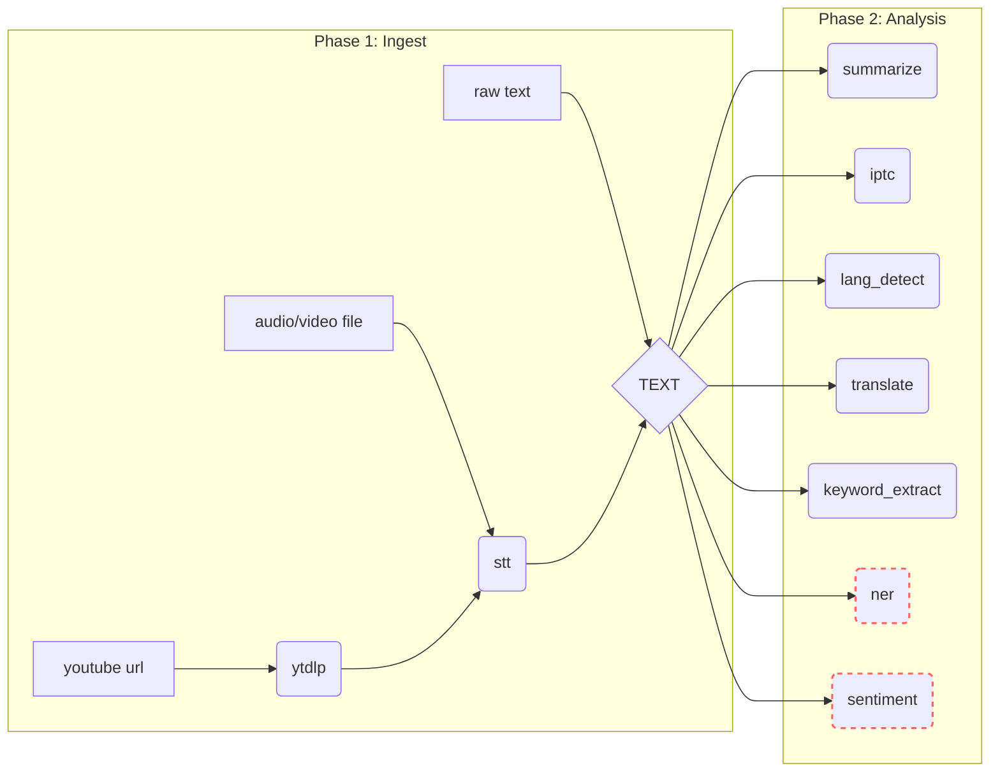
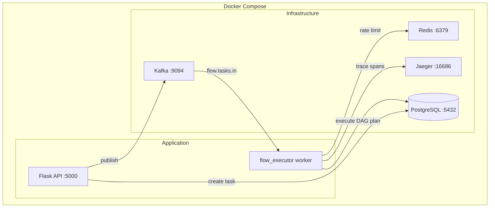

# QFlow: On-Demand AI Pipeline Orchestrator

**QFlow** is a powerful, enterprise-grade AI pipeline orchestrator built on the **QF Framework**. It has recently undergone a major architectural upgrade: replacing static JSON flow definitions with a **Dynamic DAG-based Routing Engine**. This enables QFlow to automatically compute the shortest valid path from any input type to any requested output(s), executing independent branches in parallel.

---

## 📖 Terminology & Concepts

To understand how QFlow operates, it's essential to grasp its core abstractions:

| Term | Definition |
|---|---|
| **Task** | The high-level request initiated by a client. It consists of `input_data` (text, file path, or URL) and a list of `outputs` (e.g., `ner_result`, `summary`). A Task lives in the database and tracks the entire lifecycle of the request. |
| **DAG Node** | A single processing capability (e.g., `stt`, `translate`, `summarize`). Each node declares what it consumes, what it produces, and whether it requires English text. |
| **Execution Plan** | Computed dynamically at runtime, consisting of **Ingest Steps** (Phase 1, to normalize input to `text`) and **Output Branches** (Phase 2, parallel branches for each requested output). |
| **Operator/Executor** | The Python class that implements the logic for a **Node** (e.g., `execute_http`, `execute_translate`, `execute_ytdlp`). |
| **Execution Context** | The "brain" of a running Task. It stores the original input, environment variables, outputs from every completed **Node**, and custom variables. |

---

## ⚙️ How It Works: The Dynamic DAG Engine

The processing pipeline has two clearly separated phases:

**Phase 1 — Ingest.** Every input type is normalized into `text` before any analysis happens.
- A raw text input is already `text` — Phase 1 is a no-op.
- An audio or video file goes through speech-to-text (STT) to produce `text`.
- A YouTube URL is first downloaded with `yt-dlp` to produce an audio file, then goes through STT.

**Phase 2 — Analysis.** Once `text` exists, any number of AI analysis nodes can be applied to it in parallel (Fan-out).

### The Graph


*(Nodes with dashed red borders require English input `text_en`)*

### Automatic EN Preparation
If a requested node requires English (e.g., `ner`), the planner automatically injects `lang_detect -> translate` into that branch. At runtime, the `translate` node conditionally skips itself if the text is already English.

---

## 🏗️ Architecture

### System Components



### Infrastructure Services

| Service | Image | Port | Purpose |
|---|---|---|---|
| **Kafka** | `bitnami/kafka:3.4` | 9094 | Async task dispatch and step chaining |
| **PostgreSQL** | `postgres:15-alpine` | 5432 | Task persistence (`tasks` table) |
| **Redis** | `redis:7-alpine` | 6379 | QF rate-limiting state + aggregator |
| **Zookeeper**| `bitnami/zookeeper:3.8`| 2181 | Kafka coordination |

---

## 📝 Task Execution Example: `youtube_link -> [ner, summary]`

```text
Task:   input_data={"url": "https://youtu.be/..."}, outputs=["ner_result", "summary"]
Plan:   Ingest=[ytdlp_download, stt], Branches=[[lang_detect, translate, ner], [summarize]]

  [INGEST] ytdlp_download:   SUCCESS
  [INGEST] stt:              SUCCESS (transcribes audio to text)
  
  [PARALLEL BRANCHES]
  Branch: ner_result
    [BRANCH] lang_detect:    SUCCESS (detects 'de')
    [BRANCH] translate:      SUCCESS (translates 'de' -> 'en')
    [BRANCH] ner:            SUCCESS (extracts entities)
    
  Branch: summary
    [BRANCH] summarize:      SUCCESS (generates summary)

Result: {
  "input_context": {...},
  "outputs": {
      "ner_result": { "entities": [...] },
      "summary": { "summary": "..." }
  }
}
```

---

## 🚀 Execution Engine

### Executor Functions
Each node type defines an executor:
- `execute_http`: Resolves URLs via `Config` or `ENV` and makes requests using Circuit Breakers and Retries.
- `execute_translate`: Skips processing if the text is already English, otherwise uses HTTP to translate.
- `execute_ytdlp`: Shells out to `yt-dlp` using `subprocess` to download and extract audio.

### Fan-Out Parallelism
Phase 2 runs branches concurrently using `gevent.spawn`. Contexts are shallow-copied to prevent race conditions and cross-branch mutation.

---

## 📊 Observability, Persistence & Resilience

### Tracing (OpenTelemetry)
Enabled via `ENABLE_TRACING=true`. Exported to Jaeger (`http://localhost:16686`).

### Security & Hardening
- **Path Traversal & Template Injection**: Inputs and filenames are sanitized (`src/security/sanitize.py`).
- **Graceful Shutdown**: The application traps `SIGINT` and `SIGTERM` to safely drain queues before closing connections.
- **Rate Limiting**: `POST /api/v1/tasks` is protected by a Redis sliding-window rate limit (`100 RPM` default).
- **Pagination**: `GET /api/v1/tasks` uses highly scalable cursor-based pagination.
- **Probes**: Exposes `/api/liveness`, `/api/readiness`, and `/api/health` endpoints per Kubernetes standards.

### Database Schema (`tasks` table)
| Column | Type | Description |
|---|---|---|
| `id` | UUID | Task identifier |
| `input_data` | JSONB | Original payload (url, text, or file_path) |
| `outputs` | JSONB | Requested outputs array |
| `status` | VARCHAR | `PENDING`, `RUNNING`, `COMPLETED`, `FAILED` |
| `final_output` | JSONB | DAG resolved output |

---

## 🛠️ Operational Reference

### Quickstart

```bash
# Start infrastructure
docker compose -f docker-compose.test.yml up -d

# Install and run
pip install -r requirements.txt
python main.py
```

### API Endpoints

| Method | Endpoint | Description |
|---|---|---|
| `POST` | `/api/v1/tasks` | Create task (JSON or Multipart). Returns task ID. |
| `GET` | `/api/v1/tasks` | List tasks (Supports cursor pagination) |
| `GET` | `/api/v1/tasks/{id}`| Get task detail |
| `GET` | `/api/health` | Comprehensive DB, Kafka, and Redis check |

### Configuration (`.env`)

| Variable | Default | Description |
|---|---|---|
| `DEV_MODE` | `true` | Mock HTTP responses (random delay 0.5s - 2.0s) |
| `DATABASE_URL` | `...` | PostgreSQL connection |
| `RATE_LIMIT_RPM`| `100` | Rate limiting for task creation |

---

## 🧪 Testing

```bash
make test                # All tests
make test-unit           # Unit tests
make test-integration    # Integration tests
```

### Test Suites
- **Unit (`tests/unit/`)**: Verifies DAG Planner logic, Input Detection, and Translate Conditional Skips.
- **Integration / E2E (`tests/e2e/`)**: Full flow execution in a DB/Kafka-enabled environment, testing single outputs, fan-outs, and validation errors.

---

## 📜 Development Guidelines

### Adding a New AI Node
1. Open `src/dag/graph.py`
2. Add a new `DagNode` entry to the `NODES` dictionary. Define `input_type`, `output_type`, `requires_en`, and `config`.
3. No planner or runner changes are needed. The DAG will automatically route correctly!
