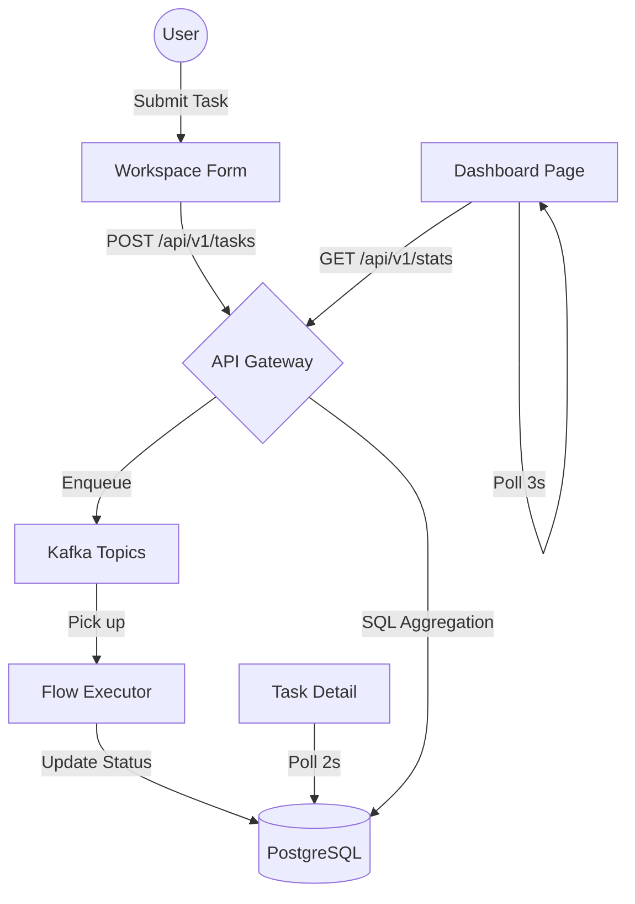
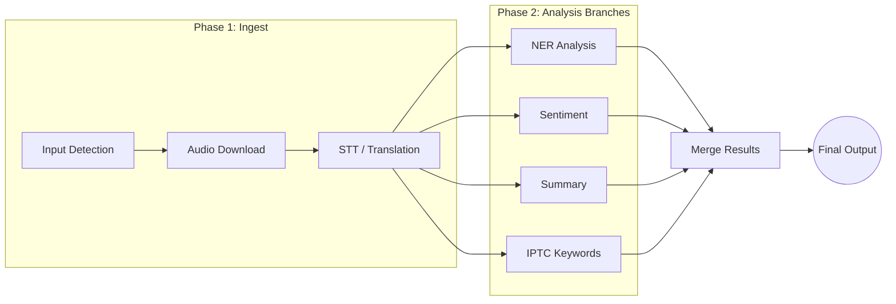

# QFlow Frontend — Analysis & Orchestration Dashboard

A high-performance, full-width **Analysis & Dashboard** tool built with React 19 and Ant Design 6. This frontend transforms the **AI Flow Orchestrator** into a sophisticated platform for monitoring global pipeline health, real-time throughput, and detailed AI task execution.

---

## 🚀 Key Functionalities

### 1. Real-Time Global Analytics (`/dashboard`)
The command center of the platform, providing bird's-eye visibility into your entire processing fleet (capable of handling 10,000+ tasks).
- **Velocity Metrics:** Real-time **TPM (Tasks Per Minute)** tracking (current vs. 15m average).
- **State-Specific Monitoring:** Dedicated counters for **Active**, **Pending**, **Completed**, and **Failed** tasks with percentage-of-total indicators.
- **Temporal Analysis:** Interactive charts with selectable granularity: **Minutes**, **Hourly**, **Daily**, and **Weekly**.
- **Latency Breakdown:** High-fidelity tracking of **Queue Latency** (wait time) vs. **Processing Speed** (execution time).
- **Flow Popularity:** Bar charts visualizing the distribution of requested AI analysis types (NER, Sentiment, Summary, etc.).

### 2. Intelligent Workspace (`/`)
A streamlined interface for initiating complex AI pipelines.
- **Multi-Modal Input:** Support for Raw Text, File Path (Audio/Video), and YouTube URLs.
- **Dynamic DAG Planning:** Select desired outputs (NER, STT, etc.), and the backend automatically calculates the most efficient execution path.
- **Recent Activity Feed:** Direct visibility into the latest submitted tasks from the home page.

### 3. High-Fidelity Task Detail (`/tasks/:id`)
Deep-dive into individual pipeline executions with real-time feedback.
- **Live DAG Visualization:** A colorful, interactive graph powered by **React Flow** showing node status (Pending, Running, Success, Failure) and LR (Left-to-Right) dot connections.
- **Latency Timeline:** A visual breakdown bar separating "Queue Wait" from "Actual Execution" duration.
- **Rich Output Viewers:**
    - **NER:** Inline entity highlighting with color-coded categories.
    - **Sentiment:** Visual score bars with emoji indicators.
    - **Summary:** Clean typography with one-click copy.
    - **Metadata:** Language detection and IPTC tagging visualized as filled tags.
- **Execution Logs:** Expandable table of technical step logs with request/response payloads for debugging.

### 4. Professional History Management (`/tasks`)
Server-side paginated list view designed for large-scale data exploration.
- **Server-Side Pagination:** Optimized for thousands of records with adjustable page sizes.
- **Global Sorting:** Sort by Age, Status, Input Type, or Duration.
- **Status Filters:** Instant filtering by task state or input channel.

---

## 🛠 Technical Architecture

### System Data Flow


### DAG Execution Strategy


---

## 🎨 Design System

- **Ant Design Pro Aesthetic:** Utilizes a clean, layout-driven design with 100% width usage.
- **Theme-Aware:** Full **Dark Mode** support using Ant Design `Design Tokens`. Charts, tables, and DAG nodes automatically adapt ox/oy axes and fill colors.
- **Responsive:** Fluid layout that scales from 13" laptops to large data-center monitors.
- **Resilient UI:** Frontend operates gracefully even if the backend is unavailable, displaying warning alerts and empty states instead of crashing.

---

## 🛠 Stack

| Category | Technology |
|---------|---------|
| **Core** | React 19, TypeScript, Vite 8 |
| **UI Framework** | Ant Design 6 (ConfigProvider + theme.useToken) |
| **Visualizations** | Ant Design Plots (G2Plot), React Flow |
| **State & Data** | TanStack Query v5, Zustand v5 |
| **Utilities** | Axios, Day.js (Plugins: UTC, Timezone, RelativeTime) |

---

## 🚀 Getting Started

1. **Install Dependencies:**
   ```bash
   cd poc_frontend
   npm install
   ```

2. **Environment Configuration:**
   Ensure `VITE_API_URL` in `.env` (or via Vite proxy in `vite.config.ts`) points to your backend.

3. **Development Mode:**
   ```bash
   npm run dev
   ```

4. **Production Build:**
   ```bash
   npm run build
   ```
